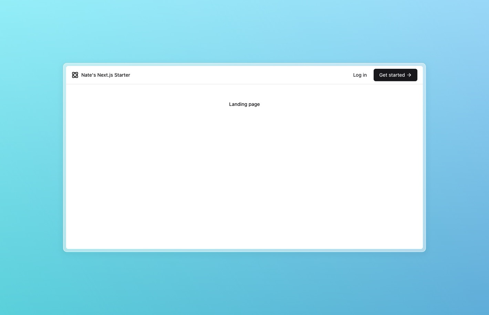
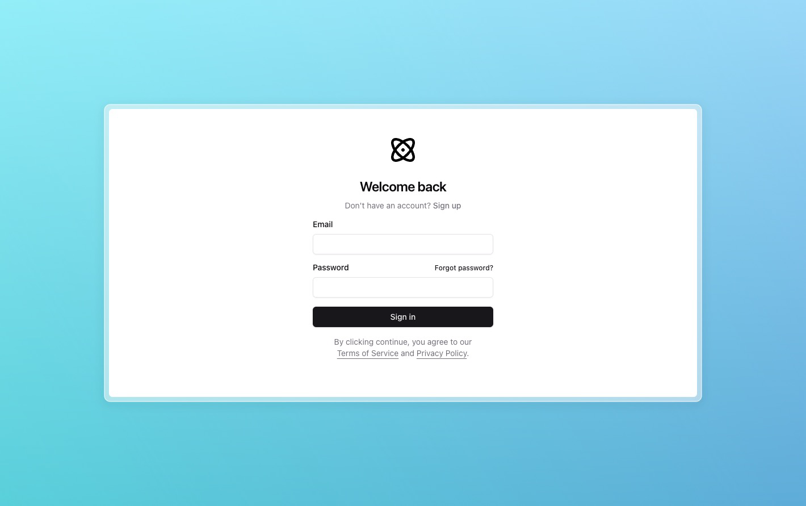
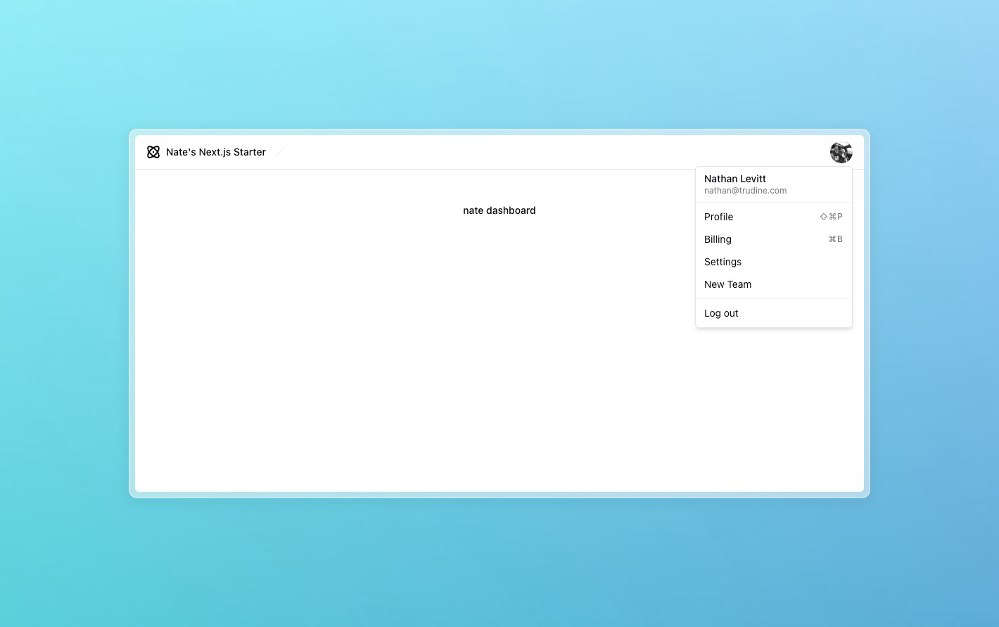

## Nate's Next.js Starter

A [Next.js](https://nextjs.org/) barebones starter project with everything you need to build a production-ready web app.

- 🚀 Next.js 15 & React 19
- 🛠️ Typescript
- 💅 Tailwind CSS + shadcn/ui + Radix
- ✨ ESlint and Prettier
- 🗄️ PostgreSQL
- 🌧️ Kysely
- 👤 Email + Password Auth
- ✉️ React Email
- 💯 Perfect Lighthouse score

## 🚀 Getting started

The easiest way to start with this template is using `create-next-app`.

```
npx create-next-app -e https://github.com/nathanlevitt/nextjs-starter
```

or

```
pnpm create next-app -e https://github.com/nathanlevitt/nextjs-starter
```

If you prefer, you can clone this repository and run the following commands to install packages and run the development server:

1. Install packages: `pnpm install` (can also use `npm`, `yarn`, or `bun`)
2. Start development server: `pnpm dev`

Open [http://localhost:3000](http://localhost:3000) with your browser to see the result.

## First steps

Create a `.env.local` file based on [lib/env.ts](lib/env.ts)

<br />







## 📜 License

This project is licensed under the MIT License. For more information, see the [LICENSE](LICENSE) file.
